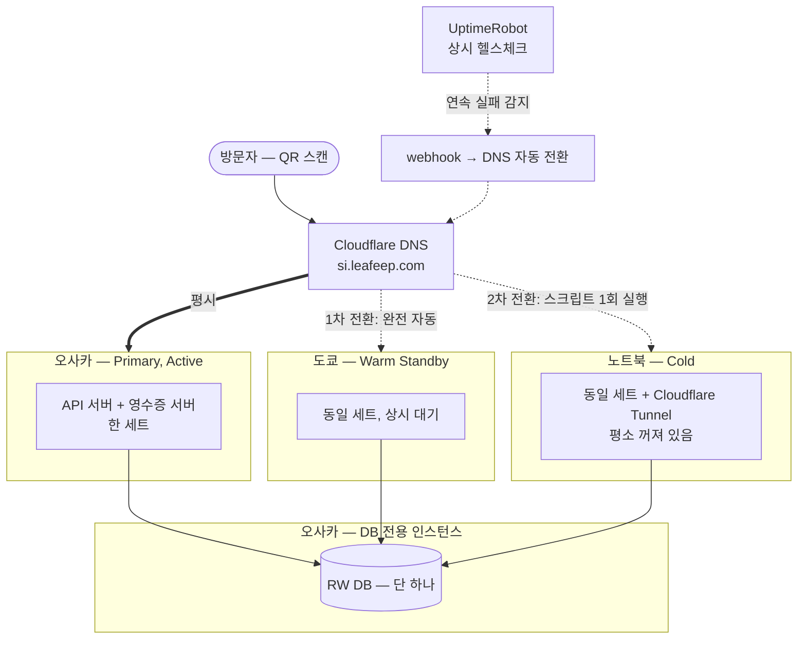
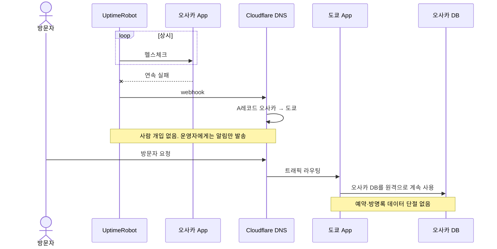

# 웹 서비스 고가용성(HA) 정책

## 1. 개요

본 문서는 7일간 운영되는 팝업 행사 웹 서비스의 고가용성 정책을 기술한다. 정책의 채택 근거(왜 이 규모에 HA를 두는가, 왜 이 구조인가)와 대비 범위의 경계를 함께 명시한다.

### 서비스 프로파일

QR 스캔으로 진입하는 모바일 웹. 방문자가 인근 상점 영수증을 인증하면 현장 좌석을 예약할 수 있다.

| 항목 | 값 |
|---|---|
| 운영 기간 | 2026-09-30 ~ 10-06 (7일) |
| 예상 일일 이용자 | 50명 미만 |
| 개발·운영 인력 | 1명 |
| 인프라 예산 | 0원 (전 구성 요소 무료 티어) |
| 서버 구성 | 백엔드 API 서버 + 영수증 추출 서버(별도 프로세스, 항상 세트로 배포) + DB |

## 2. HA 채택 근거

HA 필요 여부는 트래픽 규모가 아니라 다운타임 비용으로 판단한다. 본 서비스는 다음 두 가지 요인으로 다운타임 비용이 규모 대비 크다.

1. **웹 장애가 오프라인 현장 운영 중단으로 직결된다.** 영수증 인증과 좌석 예약이 전부 웹을 경유하므로, 서버 다운 시 현장 운영이 수기 절차로 전환된다. 이용자는 현장에서 QR을 스캔한 일회성 방문자로, 로딩 실패 시 재시도 없이 이탈한다.
2. **운영 기간이 7일로, 장애 1시간의 상대 비용이 크다.** 연간 서비스의 가용성 99%는 연 3.65일의 다운을 허용하지만, 7일 서비스에서 반나절 다운은 전체 운영 기간의 7%에 해당한다.

운영 기간 중 코드 변경은 최소화하며, 장애 발생 확률 자체는 낮게 본다. 본 정책은 장애 확률이 높아서가 아니라 **낮은 확률의 장애조차 발생 시 비용을 수용할 수 없어서** 도입한다. 목적은 원인을 불문하고 App 계층 장애로 인한 서비스 중단을 사람 개입 없이 복구하는 것이다.

## 3. 핵심 원칙 — 상태를 분산하지 않는다

> 가용성은 계산(compute)에만 부여하고, 상태(state)에는 부여하지 않는다.

App 계층(API 서버 + 영수증 추출 서버 세트)은 3중으로 준비하되, 쓰기 가능한 DB는 오사카 리전에 단 하나만 둔다. 어느 App이 트래픽을 받든 동일한 DB를 원격으로 사용한다.

**근거.** HA 설계 난이도의 대부분은 서버 수가 아니라 상태 정합성에서 발생한다 — split-brain, 복제 지연, 페일오버 중 축적된 데이터의 병합. compute 계층은 stateless이므로 복제 비용이 거의 없으나, 상태를 두 곳에 두는 순간 위 문제가 전부 발생한다. 따라서 비용이 낮은 쪽(compute)만 다중화하고 비용이 높은 쪽(state)은 단일로 유지한다.

**효과.** 본 구조에는 다음 문제가 존재하지 않는다.

- split-brain — 쓰기 지점이 하나이므로 노드 간 데이터 불일치가 원천적으로 불가능
- 복제 지연 — 복제 자체가 없음
- 페일백 시 데이터 병합 — 페일오버 중에도 데이터는 단일 DB에 축적되므로, 복구는 DNS 원복으로 종료

**대가.** 오사카 DB 장애 시 3중 계층 전체가 동시에 중단된다. 이 리스크는 제거된 것이 아니라 위치를 지정해 수용한 것이다(7장, 8장 참고). 7일 운영·일 50명 규모에서 단일 인스턴스 장애 확률에 상태 분산의 복잡성을 지불하지 않는다.

## 4. 복구 목표 (RTO / RPO)

| 시나리오 | RTO (복구 시간 목표) | RPO (데이터 손실 허용량) |
|---|---|---|
| 오사카 App 장애 | 헬스체크 감지 지연 + DNS 전환. 분 단위 — 리허설(9장) 실측으로 확정 | **0** |
| 오사카·도쿄 동시 장애 | 운영자 개입(노트북 기동) + 스크립트 1회 실행 — 리허설 실측으로 확정 | **0** |
| 오사카 DB / 리전 전체 장애 | — (대비 범위 밖, 8장) | 장애 시점 이후 전체 |

RPO가 0인 이유: 모든 계층이 단일 DB에 직접 쓰므로, 페일오버 과정에서 손실되는 쓰기가 구조적으로 존재하지 않는다. 이는 3장 결정의 직접 효과다.

## 5. 아키텍처

| 구성 | 내용 | 근거 |
|---|---|---|
| App/DB 인스턴스 분리 | 오사카 내에서 App과 DB를 별도 인스턴스로 운영 | App 프로세스 장애(크래시·재시작)가 DB 가용성에 영향을 주지 않도록 격리 |
| App 세트 단위 이동 | API 서버와 영수증 추출 서버는 동일 인스턴스에서 함께 기동·중단 | 전환 시 "API는 도쿄, 영수증은 오사카" 같은 부분 전환 상태를 배제 |
| 비대칭 3중화 | 도쿄는 warm(자동 전환), 노트북은 cold(수동 기동 후 스크립트 전환) | 상시 꺼져 있는 노드는 자동 전환이 원리적으로 불가 |
| 헬스체크 범위 | App 프로세스 응답만 검사, DB 연결은 검사하지 않음 | 전 계층이 동일 DB를 사용하므로 DB 장애는 전환으로 해결 불가 — 검사에 포함하면 불필요한 전환만 유발. 전환은 "App 교체가 해결하는 장애"에만 반응해야 함 |
| 전환 로직 위치 | 보호 대상(오사카·도쿄) 외부에서 실행 — 예: Cloudflare Worker. 구체 구현은 착수 시 확정 | 전환 장치가 보호 대상과 함께 중단되는 순환 의존 배제 |
| 노트북 노출 방식 | Cloudflare Tunnel (아웃바운드 전용) | 국내 통신사 CGNAT의 인바운드 차단 우회 |
| 비용 | OCI Always Free(오사카·도쿄) + Cloudflare 무료 + UptimeRobot 무료 | 0원 유지 |

## 6. 장애 시나리오별 동작

### 6.1 오사카 App 장애 (프로세스 크래시, 인스턴스 장애 등)

전환은 완전 자동이다. 운영자는 알림 수신 후 오사카를 복구하며, 그동안 서비스는 도쿄에서 정상 동작한다.

### 6.2 오사카·도쿄 동시 장애

노트북은 평시 꺼져 있으므로 자동 전환이 불가능하다. 수동 개입을 **노트북 전원 인가 + 스크립트 1회 실행**으로 한정한다. 스크립트가 Cloudflare Tunnel 기동과 DNS 전환을 일괄 처리한다. 노트북 역시 오사카 DB를 원격으로 사용하므로 데이터 연속성은 유지된다.

### 6.3 오사카 DB 장애 / 오사카 리전 전체 장애

본 정책의 대비 범위 밖이다(8장 참고). 이 경우 전 계층이 중단된다.

### 6.4 페일백

오사카 App 복구 후, **헬스체크 연속 통과 30분을 관찰한 뒤** DNS를 오사카로 원복한다. 페일백은 자동화하지 않고 운영자가 수행한다 — 불안정한 노드로의 자동 복귀가 반복되는 플래핑을 방지하기 위함이다. DB가 단일이므로 원복 시 병합할 데이터는 없다.

## 7. 단일 장애점(SPOF) 목록

본 구조에 남아 있는 SPOF를 명시한다. 각각 모르는 리스크가 아니라 알고 수용한 리스크다.

| SPOF | 장애 시 영향 | 처리 |
|---|---|---|
| 오사카 DB 인스턴스 | 전 계층 동시 중단 | 수용 — 8장 |
| UptimeRobot / Cloudflare | 감지 또는 전환 불발. 단 서비스 자체는 계속 동작하며, App 장애와 겹칠 때만 실제 다운으로 이어짐 | 외부 SaaS의 자체 가용성에 위임. App 장애와의 결합 확률은 수용 |
| 전환 로직 실행 환경 | 보호 대상과 같은 곳에 있으면 함께 중단되어 자동 전환 무력화 | 보호 대상 외부 배치 원칙으로 해소 — 5장 |

## 8. 대비 범위 제외 항목

| 항목 | 내용 | 제외 근거 |
|---|---|---|
| 오사카 DB / 리전 전체 장애 | 전 계층 동시 중단 | 대비하려면 DB 복제가 필요하며, 3장에서 회피한 문제(split-brain, 병합)가 전부 재발생. 7일 운영에서 리전 단위 장애 확률에 해당 복잡성을 지불하지 않음 |
| 자동 페일백 | 수동 수행 | 플래핑 방지 (6.4) |
| 감지~전환 사이 공백 | 헬스체크 감지 지연만큼의 다운 존재 | 정책이 아닌 구현 파라미터(체크 간격, 프록시 설정)로 축소하는 문제 |
| 오케스트레이터(Kubernetes 등) | 미도입 | 장애 도메인 불일치 — 오케스트레이터는 클러스터 내부 장애를 대비하며, 단일 리전 클러스터는 리전과 함께 중단됨. 상태 문제는 오케스트레이터 범위 밖이며, 상태를 단일화한 시점에 도입 실익이 없음 |

## 9. 검증

검증되지 않은 페일오버 경로는 없는 것으로 간주한다. 운영 개시 전 다음 리허설을 수행한다.

1. **1차 전환** — 오사카 App 강제 종료 → 감지·DNS 전환·알림이 자동 수행되는지 확인, RTO 실측
2. **2차 전환** — 오사카·도쿄 동시 차단 → 노트북 기동 절차 실행, 소요 시간 실측
3. **페일백** — 원복 절차 수행, 데이터 정합 확인

실측치로 4장 복구 목표의 RTO를 확정한다.
